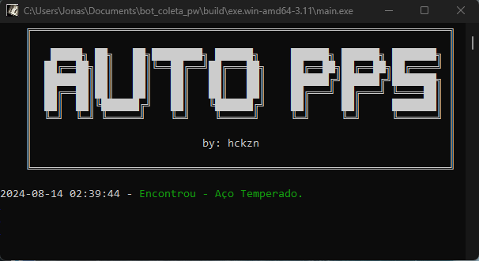

# Auto Coleta

## Descrição

O **Auto Coleta** é um script Python desenvolvido para automatizar a coleta de materiais em um ambiente gráfico. Ele captura a tela do desktop, identifica imagens de materiais específicos e clica automaticamente sobre eles. Ideal para tarefas repetitivas em que a detecção de imagens é necessária.

## Recursos

- Captura a tela do desktop.
- Identifica imagens de materiais com base em templates.
- Clica automaticamente nas imagens encontradas.
- Exibe logs de materiais encontrados com destaque colorido.

## Imagem do Programa

 <!-- Substitua pelo caminho da sua imagem -->

## Instalação

### Pré-requisitos

Certifique-se de que você tem o Python e o `pip` instalados. O script também requer as seguintes bibliotecas:

Você pode instalar as dependências com o seguinte comando:

```bash
pip install -r requirements.txt